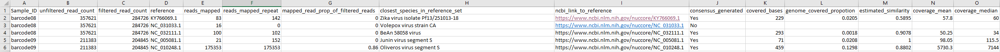

# WaSPPipe Sample Metadata Output Columns

This document describes the columns written to each per-sample metadata CSV by `bin/metadata_assembler.py`.

The script combines information from per-reference read counts, filtered and unfiltered read totals, consensus generation, and coverage statistics into a single sample-level table.

---
## Example output

  

## Column headers

### Sample_ID
- **Description:** Sample identifier, derived from the input barcode/sample directory name.
- **Source:** Parsed from the filename of the read count files.

### unfiltered_read_count
- **Description:** Total number of reads before quality and length filtering.
- **Source:** Counted from the input read files before any processing.

### filtered_read_count
- **Description:** Number of reads after the initial quality/length filtering step.
- **Source:** Calculated at the end of the `readFilter` step. By default reads between 100 and 1500 bp in length, and above Q12 are kept.

### reference
- **Description:** Reference accession or identifier.
- **Source:** This is the accession or identifier for the sequence in the reference file provided that reads have been mapped to. This does not guarantee that the species is present in your sample.

### reads_mapped
- **Description:** Number of reads mapped to this reference in the main mapping step.
- **Source:** Calculated by inspecting the bam file after the `readMapper` step.

### reads_mapped_repeat
- **Description:** Number of reads mapped to this reference in the repeat/remap stage when `remap_all` or `top_hit_only` workflow is used. This is remapping all the reads against only the reference identified in the `reference` column.
- **Source:** Calculated by inspecting the bam file after the `topMapper` or `repeatMap` steps.
- **Note:** Not present if repeat mapping is not used.

### mapped_read_prop_of_filtered_reads
- **Description:** Fraction of filtered reads mapping to the reference (0-1).
- **Calculation:** `reads_mapped / filtered_read_count`, or `reads_mapped_repeat / filtered_read_count` when repeat mapping is available.
- **Note:** Rounded to 2 decimal places.

### closest_species_in_reference_set
- **Description:** This is the species annotation for the reference identified in the `reference` column.
- **Source:** Derived from the reference FASTA header metadata. This is to highlight what the species of the sequence in the reference file is, and does not guarantee that this sepcies is present in your data. 

### ncbi_link_to_reference
- **Description:** NCBI Nuccore URL for the reference accession.
- **Note:** This is the link to the NCBI page for the reference sequence with reads mapped to it. 

### consensus_generated
- **Description:** Whether or not a consensus sequence was generated for that reference.
- **Note:** A consensus file will be generated if it meets the minimal criteria. By default a reference must have at least 50 reads mapped to it, and have some region with greater than 20x read depth, to have a consensus generated.

### covered_bases
- **Description:** Number of non-`N` bases in the generated consensus for the reference.
- **Source:** Calculated from the consensus sequence.
- **Note:** This does not consider if there might be more than one amplicon present in the output consensus sequence, and just gets a global count of non-`N` bases in the consensus sequence.

### genome_covered_propotion
- **Description:** Proportion of the reference genome covered by non-`N` consensus bases (0-1).
- **Calculation:** `covered_base_counter / length of consensus_seq`
- **Note:** This is the fraction of consensus bases that are not masked as `N`.

### estimated_similarity
- **Description:** Estimated similarity between the consensus and the reference at covered positions.
- **Calculation:** `identical base count between sample and reference / non-N base count of sample`
- **Note:** This provides an indicator of how similar the generated consensus sequence is to the reference sequence that was used to generate it (ie how many mismatches there are). This will be highly dependent on whichever reference sequence was used to generate the consensus sequence so is only meaningful in that context.

### coverage_mean
- **Description:** This is the mean read depth across non-zero sites in the coverage data for the reference.
- **Note:** Any site in the sample with at least 1 read mapped to it will be considered for read depth calculations. This does not consider that there may be more than one amplicon in the consensus at different read depths and returns just the mean read depth across all the sites with at least 1 read mapped.

### coverage_median
- **Description:** This is the median read depth across non-zero sites in the coverage data for the reference.
- **Note:** Any site in the sample with at least 1 read mapped to it will be considered for read depth calculations. This does not consider that there may be more than one amplicon in the consensus at different read depths and returns just the median read depth across all the sites with at least 1 read mapped.

---

## Full column order in the output CSV

The script writes the columns in this order:

1. `Sample_ID`
2. `unfiltered_read_count`
3. `filtered_read_count`
4. `reference`
5. `reads_mapped`
6. `reads_mapped_repeat`
7. `mapped_read_prop_of_filtered_reads`
8. `closest_species_in_reference_set`
9. `ncbi_link_to_reference`
10. `consensus_generated`
11. `covered_bases`
12. `genome_covered_propotion`
13. `estimated_similarity`
14. `coverage_mean`
15. `coverage_median`

---

## Notes

- `reads_mapped_repeat` is only present if a re-mapping step was run.
- The metadata file for each sample is written as `<sample_ID>_sample_metadata.csv` in the sample output folder.
- All the individual metadata tables are then combined into the `<run_ID>_run_metadata.csv` saved in the `output` folder.
