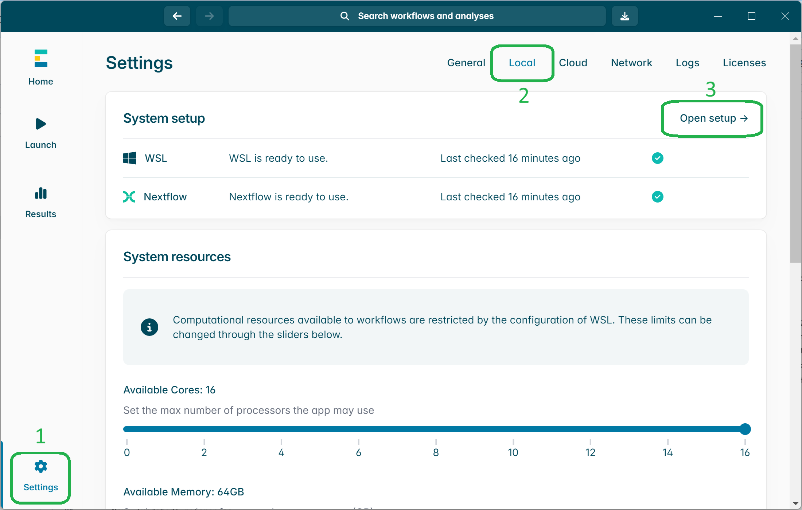
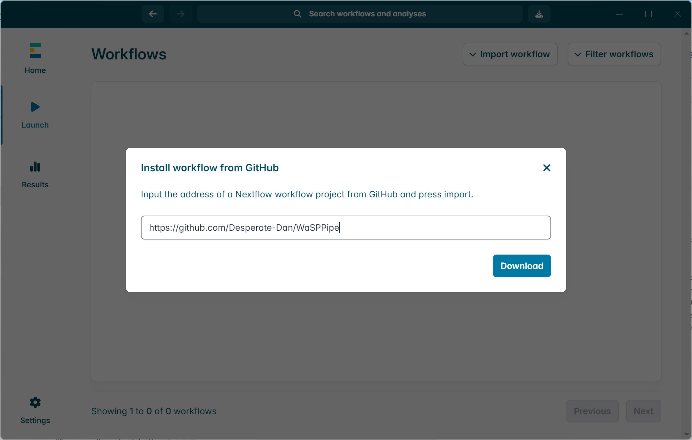
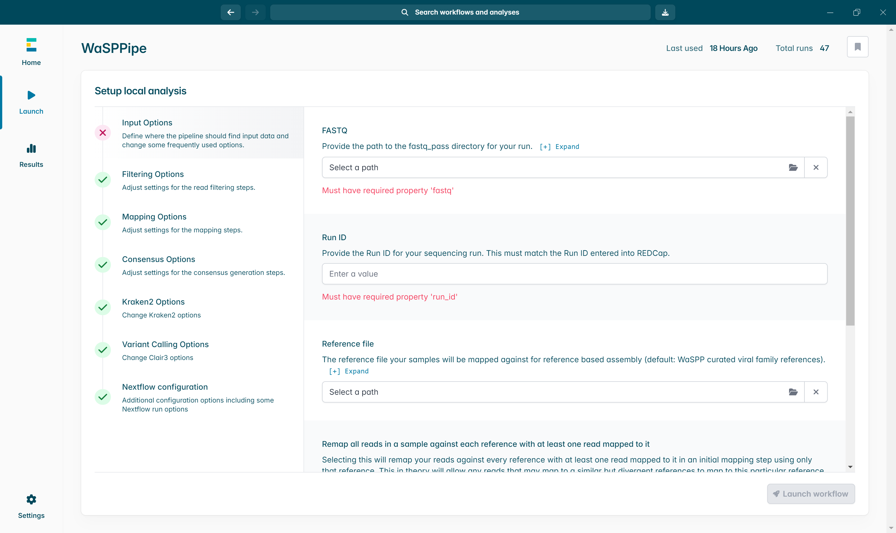
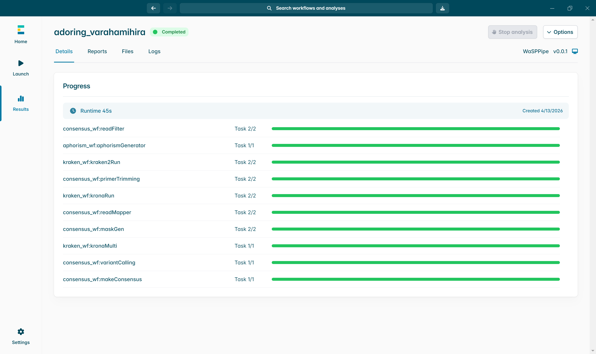
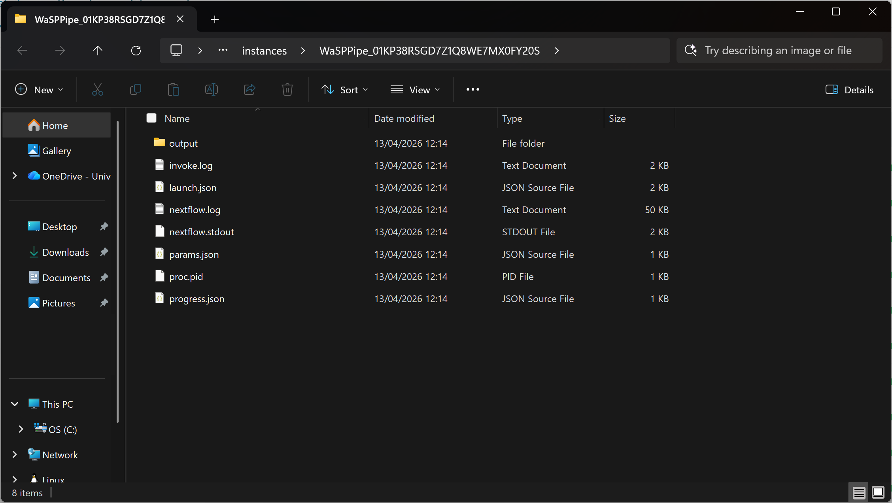
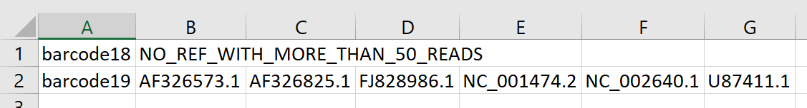
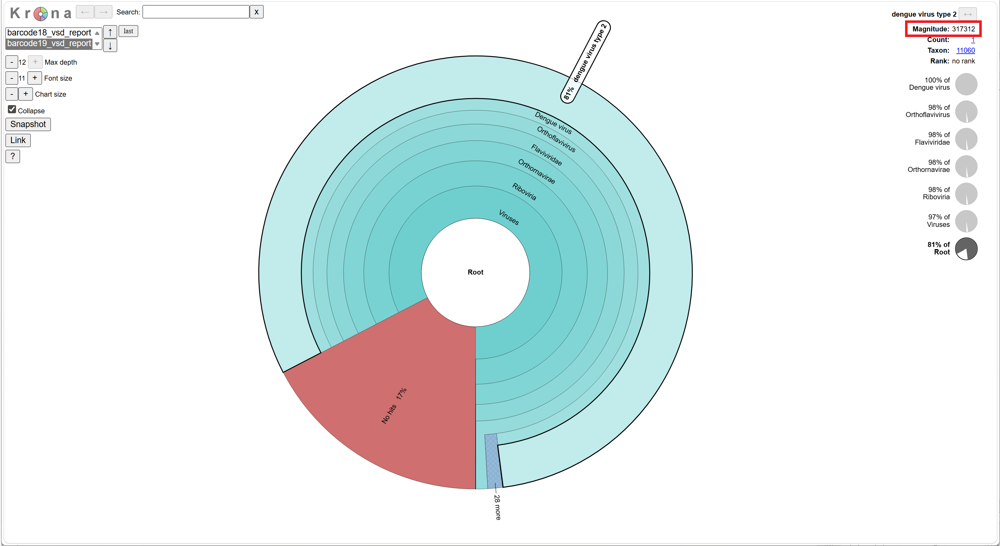
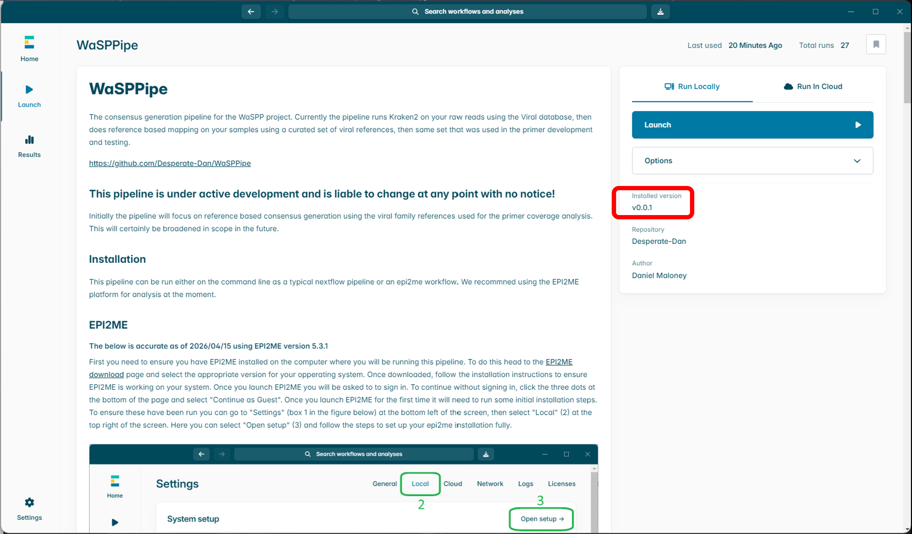
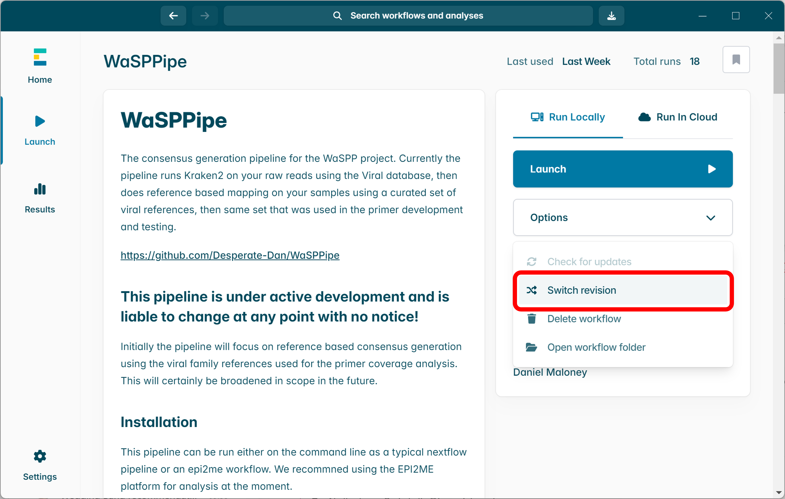
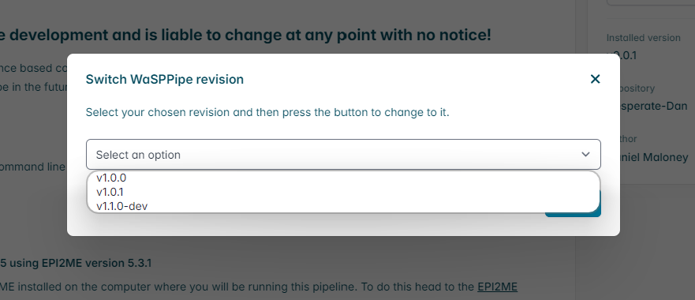

# WaSPPipe
The consensus generation pipeline for the WaSPP project. Currently the pipeline runs Kraken2 on your raw reads using the Viral database, then does reference based mapping on your samples using a curated set of viral references, then same set that was used in the primer development and testing.

https://github.com/Desperate-Dan/WaSPPipe

## This pipeline is under active development and is liable to change at any point with no notice!
Initially the pipeline will focus on reference based consensus generation using the viral family references used for the primer coverage analysis. This will certainly be broadened in scope in the future.

## Installation
This pipeline can be run either on the command line as a typical nextflow pipeline or an epi2me workflow. We recommned using the EPI2ME platform for analysis at the moment.

## EPI2ME
#### The below is accurate as of 2026/04/15 using EPI2ME version 5.3.1 
First you need to ensure you have EPI2ME installed on the computer where you will be running this pipeline. To do this head to the [EPI2ME download](https://labs.epi2me.io/downloads/) page and select the appropriate version for your opperating system. Once downloaded, follow the installation instructions to ensure EPI2ME is working on your system. Once you launch EPI2ME you will be asked to to sign in. To continue without signing in, click the three dots at the bottom of the page and select "Continue as Guest". Once you launch EPI2ME for the first time it will need to run some initial installation steps. To ensure these have been run you can go to "Settings" (box 1 in the figure below) at the bottom left of the screen, then select "Local" (2) at the top right of the screen. Here you can select "Open setup" (3) and follow the steps to set up your epi2me installation fully.

<p align="center">
  
</p>

### Add WaSPPipe workflow to EPI2ME:
To add the WaSSPipe workflow to EPI2ME select "Launch" from the panel on the left, then select "Import workflow" from the top of the page and past in the URL for the WaSSP workflow (https://github.com/Desperate-Dan/WaSPPipe), as in the image below, and click Download.

<p align="center">
  
</p>

### Run WaSPPipe
Select WaSPPipe from the "launch" menu, then click the blue "Launch" button from the righthand side of the window. You should then see a page similar to the image below.

<p align="center">
  
</p>

The only input required to run this pipeline is the the `FASTQ` option, where you need to provide the path to the `fastq_pass` folder of the sequencing run you wish to analyse. To do this, click on "select a path" under `FASTQ`, then select "Folder" from the pop up menu, then navigate to the location of the `fastq_pass` folder from your run and click "select folder". The bar should now show something like `C:\path\to\sequencing\run\fastq_pass` if you are on a windows computer.

You can now select "Launch Workflow" from the bottom right of the screen and your analysis will start!

There are lots of setting that you can alter if you wish but currently the defaults are set to work with the standard WaSPP primer sets. In the future these are likely to change but will be discussed at consortium meetings and will be updated in future versions of the pipeline.

#### The first time the WaSSPipe workflow runs, it will download the necessary software for the pipeline to run. This will require ~2Gb of storage space and can be slow depending on your internet connection. This will only happen the first time the pipeline is run (per update), so future runs of the piepeline will be quicker.

### Outputs
If your pipeline has finished successfully, you will see a page similar to that below. Here you can click on the "Options" box at the top right of the window and select "Open folder".

<p align="center">
  
</p>

In the newly opened folder you will see various log files as well as another folder called "output" as below.

<p align="center">
  
</p>

Open this "output" folder and you will see a folder per barcode in your sequencing run, as well as a folder called "kraken2_krona_plots_combined" and a file called "Ref_matches_report.csv". If you open the "Ref_matches_report.csv" file you will get a breakdown of which barcodes had enough reads mapping to them to produce a consensus sequence and which did not. In the image below you can see that barcode 18 did not have a reference where at least 50 reads mapped, so no consensus was made for that barcode. However barcode 19 had multiple references where at least 50 reads mapped, so multiple consensus sequences were made. The accession numbers here correspond to the reference(s) that the reads in barcode 19 mapped to. You can use these accession numbers in the NCBI websites (eg [Genbank](https://www.ncbi.nlm.nih.gov/genbank/)) to see what species of virus the reads are mapping to. You can find all the consensus sequences generated (and all other ancillary files) in each of the "barcode" folders within the "output" folder.

<p align="center">
  
</p>

You may also wish to view the Kraken2 reports for each of the barcodes, to see what taxonomic level Kraken2 predicts the reads in a sample map to. You can open the "Multi_krona.html" file located in the "kraken2_krona_plots_combined" folder to do this. In these krona plots, you will see the proportion of reads that map to a given taxonomic level in the dount chart. You can click on these sections to expand them and explore sub-levels of each. In the top left you can choose the krona plot for each barcode separately. Importantly, in the top left panel, the `Magnitude` number represents the number of reads at that given taxonomic level. In the image below you will see an example Krona plot of the Kraken2 results for barcode 19 in our example dataset. You can see that Dengue virus 2 makes up 81% of the sample. After clicking on Dengue virus 2, you will see the magnitude, or number of reads predicted to be Dengue virus 2, is 317,312 (as highlighted by the red box)

#### NB: ~~Currently the only Kraken2 database option in WaSPPipe is the viral database. This means that Kraken2 will only predict viral taxons in the sample, so a barcode with no hits could still have plenty of bacterial reads in it for example. The option to run other Kraken2 databases will be added in the future.~~ 
#### v1.2.0 has added the ability to change databases! You can now use either the Viral database (default) or the Standard-8Gb databse. See the [release notes](https://github.com/Desperate-Dan/WaSPPipe/releases/tag/v1.2.0) for more details.

<p align="center">
  
</p>

Since release **v1.2.0** there has been an extended metadata file produced by the pipeline. You can see an example of the output table below. This metadata file is located in the output directory of your analysis run and will be called `<run_ID>_run_metadata.csv`. It contains lots of information on the consneus generation process and has a row per sample (barcode) per reference with reads mapped to it. Much more detail on the contents of the new metadata file can be found [here](METADATA_COLUMNS.md).

<p align="center">
  
</p>

In v1.2.0 a coverage plot is also output for each barcode where there is sufficient coverage to generate a consensus sequence. This coverage plot can be found in the `mask_generate_4` folder of your barcode of interest. The plot is an interactive html file so should open in your internet browser of choice. An example plot can be found [here](https://desperate-dan.github.io/WaSPPipe/example_coverage_plot.html).

### Errors
As this pipeline is in an early stage of development we expect there to be a range of new an exciting errors produced when running it. If your pipeline says "Stopped with error", the first thing to do is look at the "Logs" tab in your EPI2ME run, and read the "Nextflow Logs" section. It is possible that the pipeline can't see your fastq_pass folder for instance. 

If you can't see anything obvious here, please get in touch with me, either through raising an Issue on this page, or via email. To make it as easy as possible for me to help you, please send me the log files produced by the run that fails. You will find these in the folder where the "Ouput" folder is contained (see above as to how to navigate to this folder), as in the image below.

#### Please send me all the files here but not the "Output" folder.

<p align="center">
  
</p>

## Updating WaSPPipe
As WaSPPipe is in active development, it is important to keep up to date with the latest releases of the pipeline. Thankfully this is quite straightforward in EPI2ME. You can check which version of the pipeline you are currently using from the WaSPPipe launch page. In the screenshot below you can see the version number in the red box.

<p align="center">
  
</p>

To update WaSSPipe to the latest version you can select "Options" at the top right of the WaSPPipe launch page, then select "Swtich revision" from the drop down menu (red box in the screenshot below)

<p align="center">
  
</p>

A pop up menu will now appear with options for you to choose which revision (version) of WaSPPipe you would like to use. WaSPPipe uses semantic versioning, so all versions should be in the format vN.N.N. You should choose the highest version number, but not one that has `-dev` after it, as these ones are just for developer testing. In the screenshot below then newest version ready for general use is `v1.0.1`.

<p align="center">
  
</p>

EPI2ME will now run your chosen version of the pipeline. To ensure you are on the correct version, you can check what the new version number of the pipeline is by looking at the section highlighted with a red box from screenshot one of this section.

#### Note that if you are running an early version of WaSPPipe it is possible that when you select "Switch revision" you will get a message saying no revisions are available. In this case you need to delete the WaSPPipe workflow from the pipeline launch page by selecting "Options" then "Delete workflow" (this can be seen just below the red box in screenshot two of this section), and then adding the workflow again as per the instructions in [this section of the installation guide.](https://github.com/Desperate-Dan/WaSPPipe/blob/main/README.md#add-wasppipe-workflow-to-epi2me)


## Command line WaSPPipe
To run this pipeline on a BASH command line you need to have [nextflow](https://docs.seqera.io/nextflow/install) and [docker](https://docs.docker.com/engine/install/) installed on your computer. Verify the installation of these two tools by running:
```
nextflow -version
docker --version
```
#### Note that if you are using [docker desktop](https://docs.docker.com/desktop/) you may need to start the docker desktop program before docker commands will work in your command line environment.

Next you need to download the latest release of WaSPPipe which you will find [here](https://github.com/Desperate-Dan/WaSPPipe/releases). We recommend downloading the ```.tar.gz``` file to work with the commands below. Move the downloaded file to where you would like the files for the pipeline to be kept, and extract the folder with the following command:
```
tar -xf WaSPPipe-1.0.1.tar.gz
```
#### Be sure to change the version number in the above command (1.0.1 in this example) to the version appropriate for your file.
WaSPPipe is now ready for use. To run the pipeline the only required input is the ```--fastq``` flag, which requires the path to the ```fastq_pass``` folder for your sequencing run. You could run the pipeline with a command such as:
```
nextflow run /path/to/WaSPPipe-1.0.1/main.nf --fastq /path/to/fastq_pass/
```
You can alter any of the parameters for the pipeline on the command line by using the appropriate flag. For a description of all relevant parameters for the pipline check out the [PARAMETERS.md](PARAMETERS.md) file. For example if you wanted to alter the ```max_length``` parameter you would add the ```--max_length``` flag to the command line argument with the value you would like to change it to:
```
nextflow run /path/to/WaSPPipe-1.0.1/main.nf --fastq /path/to/fastq_pass/ --max_length 2000
```


### Future additions to WaSPPipe
 - More (updated) references.
 - Read clustering/de novo based consensus generation.
 - More Kraken2 databases.
